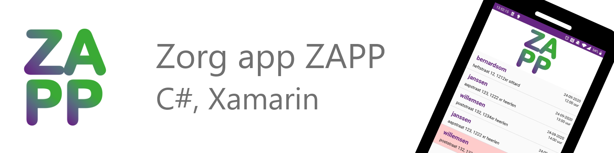
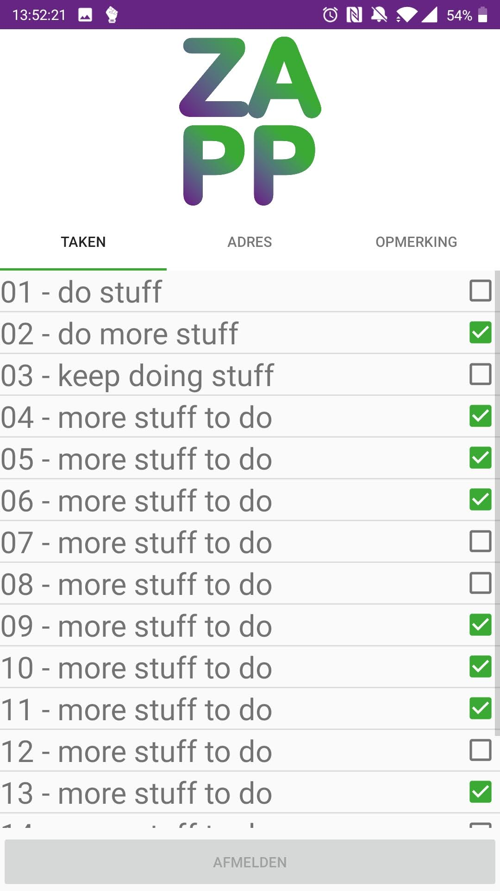
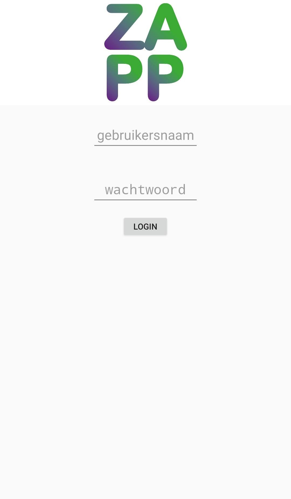
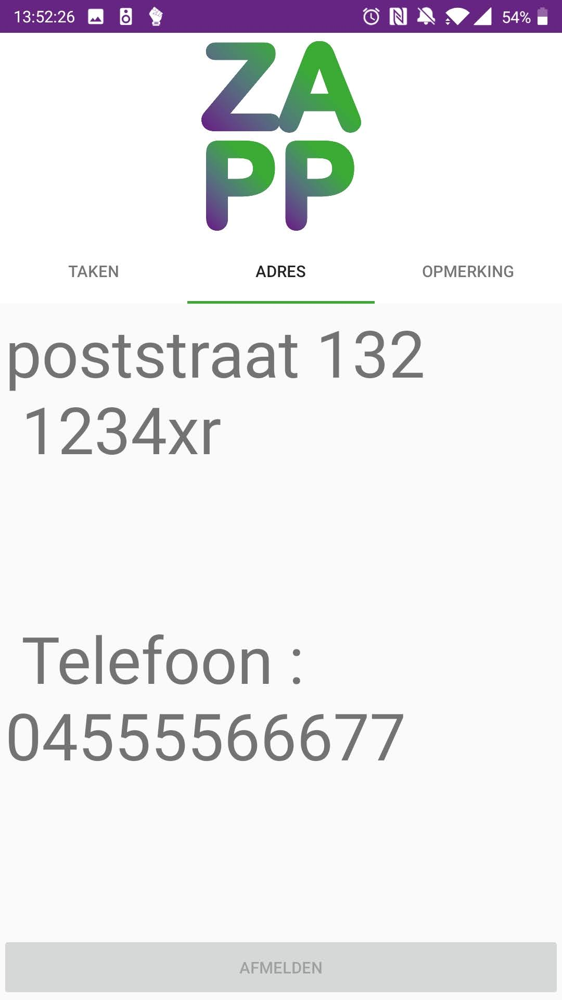

      

# ZAPP

ZAPP is een case waarbij het de bedoeling is om een Zorgapp te maken die 1ste en 2de lijns-zorgverleners helpt hun taken uit te voeren bij cliënten. Gebruikers moeten de eerste keer inloggen en krijgen daarna een lijst te zien met afspraken waar ze die dag naartoe moeten. Wanneer een afspraak geselecteerd wordt, krijgt de gebruiker een scherm te zien met de taken die bij deze afspraak voltooid moeten worden. Deze taken kunnen afgevinkt worden nadat de gebruiker zich heeft aangemeld bij de afpraak. Er kan pas bij een andere afspraak aangemeld worden als alle taken bij de vorige afspraak voltooid zijn en de gebruiker zich ook weer heeft afmeld. Naast de taken bevat de detailpagina ook een tablad met meer informatie over de afspraak (zoals telefoonnummer en adres) en mogelijke opmerkingen.

## Technologieën

De front-end applicatie is geschreven in C# met het Xamarin platform en mioddels een Restful API wordt de data uit Cockpit, een self-hosted headless en api-driven CMS gehaald. 
* C#
* .Net
* Xamarin
* Restful API (POST/GET/PUT/DELETE)
* XML 
* sqlite

     
     
     

